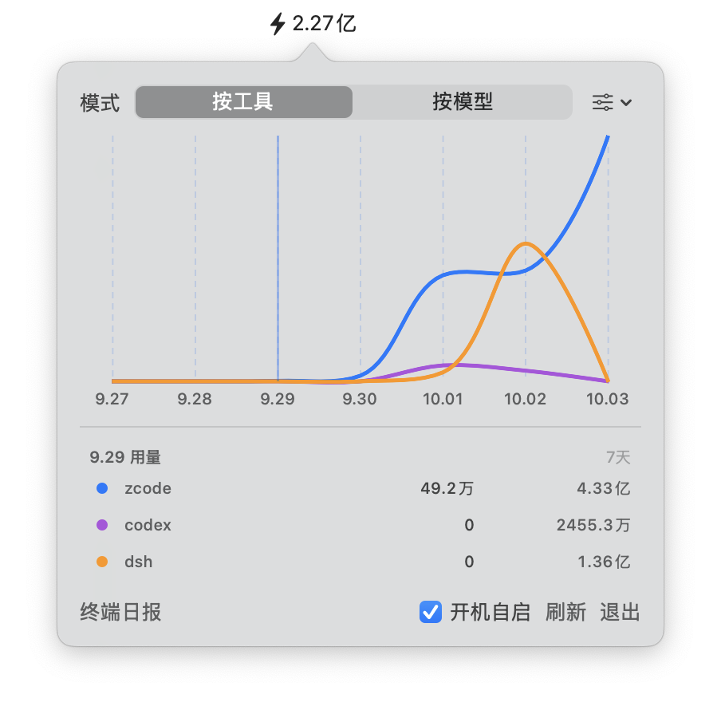

# UsageBar ⚡

macOS 菜单栏 / Windows 托盘的 AI CLI token 用量表：常驻显示今日用量，点开看 7 天曲线和精确数字，可按工具或按模型拆分。数据 100% 本地读取——它只是替你汇总各 AI CLI 自己写好的会话日志，不需要 API key，不上传任何数据。

A menu bar (macOS) / system tray (Windows) app that tracks your AI CLI token usage (Claude Code, Codex, ZCode, OpenCode, Gemini CLI, Kimi, Qwen … — everything [ccusage](https://github.com/ccusage/ccusage) supports). 7-day chart + exact numbers, fully local.

**Windows 用户直接看 [Windows 版](#windows-版) 一节。**



## 它能做什么

- **菜单栏常驻**：⚡ 后面是今日 token 总量（如 `⚡12.3万`），每 60 秒自动刷新
- **点开弹窗**：最近 7 天平滑曲线 + 当日/7 天精确用量；悬停任意一天看当天的数；按天虚线网格
- **两种视角**：按工具（zcode / codex / claude …）或按模型（GLM-5.3 / gpt …）拆分，一键切换
- **想看谁就勾谁**：默认只显示总量；在工具/模型下拉里勾选即加入曲线，列表与曲线完全同步，一键恢复默认
- **可定制**：用量列表拖拽排序（记住顺序）、点色块用系统色轮改颜色
- **终端日报**：底部「终端日报」按钮在 Terminal 打开用量报表；可选安装的 `usage` 命令还能在终端独立使用
- **开机自启**：面板内开关（登录项方式）
- **检查更新**：一个按钮查两处——引擎 ccusage 新版（npm registry，一键升级，自动跟随 brew/npm）和 UsageBar 新版（GitHub Release，一键跳转下载）；仅点击时联网

## Windows 版

同一份数据引擎（ccusage），Windows 上做成**系统托盘应用**（Razer Synapse 那种形态）：托盘常驻一枚 ⚡ 图标，左键点击弹出用量面板，右键出菜单。

- **托盘图标**：悬停 tooltip 显示今日用量；Explorer 重启后自动恢复图标
- **弹出面板**（左键托盘图标）：按工具/按模型切换、系列勾选、7 天平滑曲线、逐日用量列表（跟随图表悬停显示对应那天各工具/模型的用量）、颜色自定义——与 macOS 版面板一致；Esc 或点击外部关闭
- **托盘右键菜单**：终端日报、立即刷新、检查更新、开机自启、退出
- **检查更新**：一个按钮查两处——ccusage 新版（npm registry，一键升级）与 UsageBar 本体（GitHub Release）
- **数据 100% 本地**：`ccusage daily --offline --json --by-agent`，不联网上传
- 首次启动自动添加开机自启（HKCU Run，可随时在菜单里关闭），检测到 ccusage 未安装时面板引导一键 `npm i -g ccusage`
- 提示：Windows 默认把新托盘图标收进溢出区（^）。想让它常驻可见：右键任务栏 → 任务栏设置 → 其他系统托盘图标 → 打开 UsageBar
- 提示：从 Releases 下载的 exe 未做代码签名，首次运行 Windows 可能弹 SmartScreen 蓝色提示——点**「更多信息」→「仍要运行」**即可（仅一次）；或用 PowerShell 执行 `Unblock-File .\UsageBar.exe` 去掉下载标记

**构建（零依赖）**：Windows 10/11 自带 C# 编译器（csc.exe），不需要装任何 SDK：

```powershell
powershell -ExecutionPolicy Bypass -File windows\build.ps1          # 构建
powershell -ExecutionPolicy Bypass -File windows\build.ps1 -Run     # 构建并运行
```

产物：`windows\dist\UsageBar.exe`（单文件约 100 KB；Win10/11 直接运行，.NET Framework 4.8 系统预装）。源码就一个文件：`windows/UsageBar/Program.cs`（C# 5 + WinForms，与 mac 版"核心一个文件"对称）。数据引擎 ccusage 未装时面板会给出安装引导；没有 npm 时先装 [Node.js LTS](https://nodejs.org/)。

## 系统要求

| 依赖 | 说明 |
|---|---|
| macOS 14+ | SwiftUI Charts |
| ccusage | 数据聚合引擎。**没装也没关系**：应用首次打开会引导一键安装（Homebrew 或 npm），也可提前自己执行 `brew install ccusage` |
| python3 | 仅可选的「终端 usage 命令」需要，随 Xcode 命令行工具提供 |

## 安装（约 1 分钟）

**方式 A：Homebrew（推荐，无任何提示）**

```bash
brew install --cask zquickm/tap/usagebar
```

cask 安装时自动剥掉隔离标记，装完直接打开，没有 Gatekeeper 提示；以后 `brew upgrade` 即可更新。

**方式 B：直接下载**

1. 从 [Releases](../../releases) 下载 **`UsageBar-v*.dmg`**，打开，把 **UsageBar** 拖到右边的 **Applications** 文件夹（窗口里有图示），然后推出磁盘镜像。（Release 里另附 zip，供脚本化安装使用）
2. 首次打开会有一次 Gatekeeper 提示（DMG 安装窗口底部就印着这段指引；应用是 ad-hoc 签名、未公证，属正常，只需一次）：
   - **macOS 15 (Sequoia) 及以上**：双击打开一次，在弹出的提示里选「完成」；然后到 **系统设置 → 隐私与安全性**，往下拉到「安全性」区，点 **「仍要打开」** 并确认。
   - **macOS 14**：右键 → 打开 → 确认。
   - 或者用终端一行解决：`xattr -cr /Applications/UsageBar.app`（顺带把提示也免了）。之后正常双击打开，不再询问。

**两种方式之后都一样**：应用检测到数据引擎 ccusage 未安装时，弹窗里会出现安装卡片——点 **「用 Homebrew 安装」**（或 npm），等几分钟（首次会连 Node 一起装）即可；两者都没有时卡片会给出手动指引。打开后一分钟内，菜单栏闪电图标即显示今日用量。首次启动可能弹出「UsageBar 想要控制系统事件」——点**允许**，那是它在添加开机自启（不想要可在面板里关掉「开机自启」）。

**可选终端增强**：想要 `usage` 命令（终端里的明细报表）再跑一次：

```bash
git clone https://github.com/zquickm/UsageBar && cd UsageBar && ./install.sh
```

它把 `usage` 装到 `~/.local/bin` 并确保 ccusage 就绪；只要 app 的话**完全不用跑**。

## 日常使用

- **菜单栏**：⚡ 后的数字就是今日总 token，悬停无操作，点击开/关弹窗。
- **弹窗里**：
  - 顶部切换 **按工具 / 按模型**；
  - 图表默认只画「总量」，点开下方工具/模型下拉**勾选**想看的系列；「恢复默认」回到只看总量；
  - 列表可**拖拽排序**（顺序会记住），点系列前的**色块**改颜色；
  - 鼠标悬停曲线，面板显示那一天的日期和各系列精确用量；
  - 底部按钮：**终端日报**（Terminal 里看近 7 天明细表）、**开机自启**、**刷新**、**退出**。
- **终端里**（可选增强，`install.sh` 提供）：

```bash
usage          # 近 7 天明细表（CLI / dsh 分列，含成本）
usage 30       # 近 30 天
usage --bar    # ⚡ 今日摘要块（菜单栏同款格式）
```

面板里的「终端日报」按钮不依赖它：有 `usage` 就开 `usage 7`，没有就直接开 `ccusage daily`。

## 数据从哪来

```text
各 CLI 的本地会话日志 ──► ccusage（聚合, --offline）──► UsageBar.app（内置聚合，直接调用）
(~/.zcode, ~/.codex, ~/.claude …)                                    （菜单栏）
```

- 应用对 ccusage 只发**一次**聚合调用（`ccusage daily --by-agent --offline`），聚合、可选的 `~/.dsh` 账本合并都在应用内完成——没有中间脚本，装好 ccusage 就能用。
- 支持哪些工具、出现过哪些模型，**完全跟随你安装的 ccusage**：新工具在 ccusage 认识它日志的那天自动出现，新模型用过的当天自动出现，UsageBar 不需要跟着发版。
- ccusage 以 `--offline` 模式运行，不联网取价——整条链路数据不出你的机器。

## 常见问题

- **菜单栏显示 `n/a`？** 先在终端跑 `ccusage daily` 看有无数据或报错；也确认你确实用过受支持的 CLI、日志已生成。
- **金额是 `$0`？** ccusage 离线定价数据里没有该模型的价格，token 数不受影响。
- **提示需要 python3？** 只有想用可选的终端 `usage` 命令才需要，执行 `xcode-select --install` 即可。
- **我用的 CLI 不被支持？** UsageBar 不维护工具白名单，等 ccusage 支持后即自动计入，无需更新本应用。

## 更新与卸载

- **更新**：下载新版 Release 替换 /Applications 里的 app 即可。
- **卸载**：面板 → 退出，删除 UsageBar.app；建议卸载前先关掉「开机自启」。装过可选增强的话再删 `~/.local/bin/usage`；不再需要 ccusage 的话顺带 `brew uninstall ccusage`（或 `npm uninstall -g ccusage`）。

## 从源码构建

macOS：

```bash
APP_NAME=UsageBar BUNDLE_ID=com.cookie.UsageBar MENU_BAR_APP=1 SIGNING_MODE=adhoc \
  ARCHES="arm64 x86_64" ./Scripts/package_app.sh release
```

Swift Package（SwiftUI + Charts），核心就一个文件：`Sources/UsageBar/main.swift`。

Windows：见 [Windows 版](#windows-版) 一节，`powershell -File windows\build.ps1` 一条命令，无需 SDK。

## License

MIT — see [LICENSE](LICENSE). ccusage 有其自己的许可条款。

---

## English quick start

1. `brew install --cask zquickm/tap/usagebar` — recommended, no Gatekeeper prompt (the cask strips the quarantine stamp after install).
2. Or download **`UsageBar-v*.dmg`** from [Releases](../../releases), open it, drag **UsageBar** onto the **Applications** folder shown in the window (a Gatekeeper hint is printed right in the install window). One-time prompt (ad-hoc signed): on macOS 15+ double-click once, choose Done, then **System Settings → Privacy & Security → Open Anyway**; on macOS 14 right-click → **Open**.
3. If the data engine [ccusage](https://www.npmjs.com/package/ccusage) isn't installed yet, the popover shows a setup card — click **Install via Homebrew** (or npm) and wait a few minutes. Fully local — ccusage reads each CLI's own session logs, nothing leaves your machine.

Optional terminal extra: `./install.sh` from a repo clone puts a `usage` CLI in `~/.local/bin` (`usage` = 7-day table, `usage 30`, `usage --bar`). The app itself never needs it.
